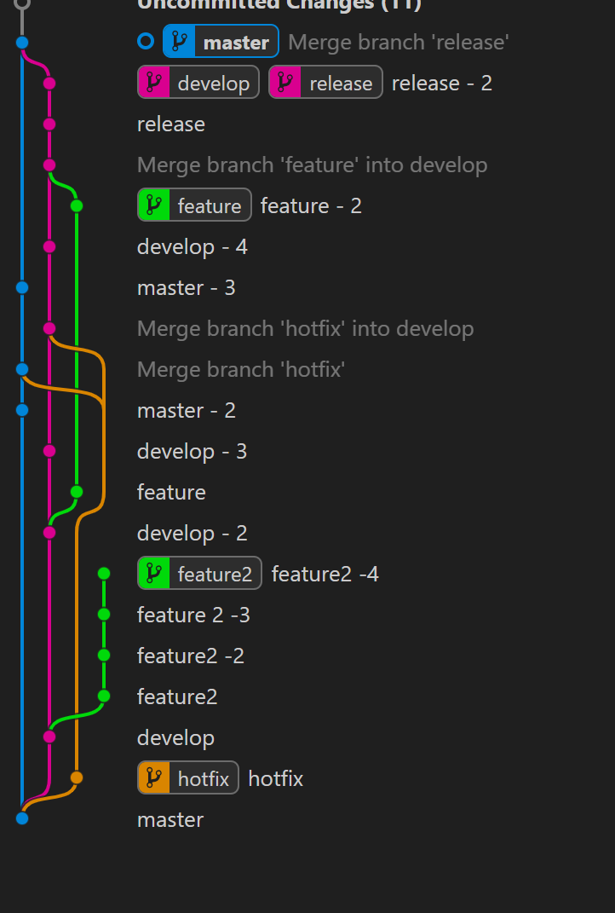

# Seguimos la siguiente secuencia

| Paso | Proceso|
|-------------|-------------|
| 1 | Creamos el branch master |
| 2 | Creamos branch hotfix y develop |
| 3| Desde develop creamos feature 2 |
| 4 | Creamos 3 commit desde feature 2 |
| 5 | Creamos commit desde develop |
| 6 | Desde develop creamos feature |
| 7 | Creamos commit en master develop |
| 8 | Hacemos merge de hotfix a master y develop |
| 9 | Creamos commit en master, develop y feature |
| 10 | Hacemos merge de feature a develop |
| 11 | Creamos release desde develop |
| 12 | Hacemos commit en develop, release y master |
| 13 | Hacemos merge de release a develop y master |

 <i>CUANDO DECIMOS CREAR NOS REFERIMOS A CREAR EL BRANCH Y HACER UN COMMIT EN ESE </i>

## PROCESO
### 1. Creamos el branch master
Se crea por defecto, vamos a inicializar un repositorio 
 
 

 
 
 
y renombrar el branch principal
 
 

 
 
Por cada nuevo branch o merge vamos a hacer un <b> commit </b>, obviare este proceso en los proximos pasos
 
 

 
 
 
 

### 2. Creamos branches hotfix y develop
Con la branch master seleccionada le damos a añadir branch
 
 

 
 
Añadimos sus respectivos nombres y hacemos un commit en cada uno de ellos
 
 

 
 
El tick nos indica en que branch nos encontramos trabajando
 
 
 
 

### 3. Desde develop creamos feature 2

Encontrandonos en el branch develop podemos pulsar añadir o en la barra de SOURCE CONTROL pulsamos branch y create branch from
 
 

 
 
 
 

### 4. Creamos 3 commit en feature 2

Cambiamos cualquier elemento del documento y hacemos 3 commits mas sobre feature 2
 
 
 
 

### 5. Creamos commit desde develop
Hacemos un commit mas en develop 

 
 
 
 

### 6. Creamos un branch feature desde develop
En este nuevo commit que hemos creado creamos un branch llamado feature

 
 
 
 

### 7. Creamos commit en master y develop
Creamos otro commit desde master y otro desde develop

 
 
 
 

### 8. Hacemos merge desde hotfix a master y develop
Con los commits que habiamos creado de ambos branches podremos hacer un merge desde la rama hotfix. Para esto nos situamos en la rama que queremos que reciba el codigo pulsamos merge y seleccionamos con cual queremos unirla 
 
 

 
 
Este merge creara un conflicto, para resolverlo pulsamos en resolve merge problems 
 
 
 
 
 
Seleccionamos que codigo queremos que prevalezca o escribimos uno nuevo intermedio
 
 

 
 
Para confirmar los cambios pulsamos en el simbolo añadir en la ventana del commit
 
 
 
 

### 9. Creamos otro commit en master, develop y feature

Hacemos un commit en cada una de las tres ramas

 
 
 
 

#### 10. Hacemos un merge de feature a develop

Situandonos en develop lo unimos a feature mediante branch>merge y resolvemos conflictos

 
 
 
 

### 11. Creamos release desde develop

Tras el commit del merge, creamos un branch nuevo llamado release desde develop.

 
 
 
 

### 12. Hacemos commit en develop, feature y  release

Hacemos un ultimo commit en las ramas develop, feature y release

 
 
 
 

### 13. Hacemos merge desde release a master y develop

Nos situamos en la rama master y hacemos merge con release, y hacemos lo mismo en la rama develop, el resultado deberia verse asi:

